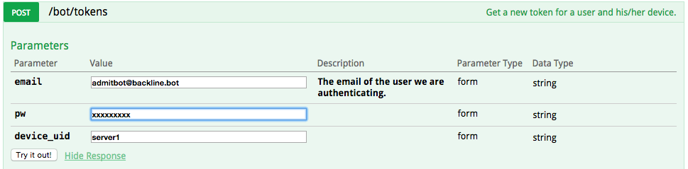
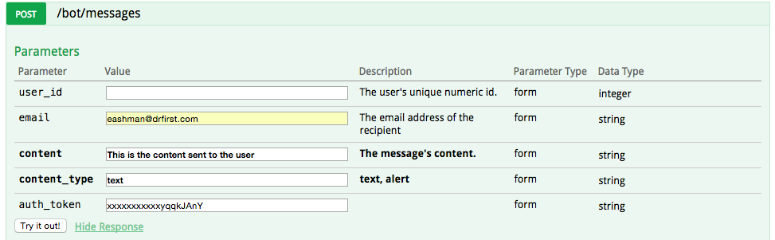
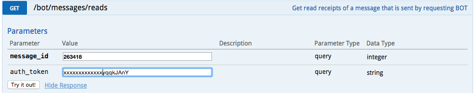

# Backline System API

What is a Backline Bot?
----

A Backline Bot is a System-to-User interface that allows non-sentient beings to send messages to Backline users.  Each Bot has it's own account and rights, similar to a human Backline user, but uses a more streamlined API to communicate with the system.


The first step to sending a Bot message is get a token for the system sending the message.  A Bot token is unique for a given user/device combination.  In the Bot's case, a device could be a server, service, or any specific identifier that will own this token and be identified as responsible for generating the message.

You will be given a Bot username and password which is used to request a token.  Bot tokens do not expire, however, if they do get reset or are removed, your software should respond by requesting a new one.


# Backline Bot API Calls

## Get API Token

> Response will look like:

```json
{
  "auth_token": "xxxxxxxxxxxayqqkJAnY",
  "pin": null,
  "user": {
    "id": 2841,
    "fname": "Admission",
    "lname": "Notification",
    "email": "admitbot@backline.bot",
    "dob": null,
    "phone": null,
    "title": null,
    "npi": null,
    "activity_status": 2,
    "last_device_type_used": "bot",
    "is_admin_tool_reset_password": false,
    "patient_search_allowed": true,
    "specialty_id": null,
    "location": null,
    "lat": null,
    "lng": null,
    "postal_code": null,
    "privacy_searchability_all_backline": true,
    "privacy_searchability_org": true,
    "privacy_email_visibility": 2,
    "privacy_phone_visibility": 2,
    "primary_org_id": null,
    "misuse_reports_count": 0,
    "clinical_role_id": null,
    "company": null,
    "pin_delay_in_seconds": 720,
    "updated_at": "2015-06-18T13:49:24.000Z",
    "license_type": 0,
    "specialty": null,
    "clinical_role": null,
    "departments": "",
    "avatar_url": "https://akario-backline.s3.amazonaws.com/avatars/73/df/1093-thumb.png?1432235863",
    "avatar_medium_url": "https://akario-backline.s3.amazonaws.com/avatars/73/df/1093-medium.png?1432235863",
    "avatar_full_url": "https://akario-backline.s3.amazonaws.com/avatars/73/df/1093-original.png?1432235863",
    "last_activity_at": null,
    "orgs": [],
    "alert": null,
    "access_locked": false,
    "was_reported_by_current_user": false,
    "client_debug": null
  },
  "feed": null,
  "queue": "admitbot.xxxxxxxe8.production.web.dqueue",
  "device_uid": "server1",
  "qid": "2841.p.admitbot@backline.bot",
  "qpw": "xxxxxxxxxbf45",
  "qserver": "pink-snake.rmq.cloudamqp.com",
  "qvhost": "production",
  "qssl": "0",
  "qtopic": "2841.admitbot.xxxxxxxxxede",
  "last_request": "2015-06-18T13:49:23.773Z",
  "proxy_url": null
}
```

This endpoint retrieves a token for making Bot requests.

### HTTP Request

`POST /api/bot/tokens`

### Parameters



## Send A Message

> Response will look like:

```json
{
  "message": {
    "_id": {
      "$oid": "5582ccb46164610f16460000"
    },
    "c_id": 1,
    "data": {
      "source_uuid": "admitbot@backline.bot",
      "source_type": "bot",
      "source_id": 2841,
      "feed_id": 12780,
      "feed_type": 3,
      "content_type": "text",
      "content": "This is the content sent to the user",
      "formatted_content": null,
      "sent_date": "2015-06-18T13:50:44.000Z",
      "from_id": 2841,
      "from_email": "admitbot@backline.bot",
      "from_lname": "Notification",
      "from_fname": "Admission",
      "from_phone": null,
      "is_unregistered_user": null,
      "org_id": 7
    },
    "date": "2015-06-18T13:50:44.799+00:00",
    "feed_seq": 8,
    "message_id": 263418,
    "reads": null,
    "type": "chat",
    "user_reads": null,
    "v1_feed_seq": 8
  }
}


```

This endpoint sends a Bot message to a user

### HTTP Request

`GET /api/bot/messages`

### Parameters




## Check for a Read Receipt

> Response will look like:

```json
{
  "user_reads": [
    {
      "_id": {
        "$oid": "5582cd5a6164612690920000"
      },
      "data": {
        "reader_email": "eashman@drfirst.com"
      },
      "date": "2015-06-18T13:53:30.000+00:00",
      "feed_id": 12780,
      "message_id": 263418,
      "type": 1,
      "user_id": 413
    }
  ]
}

```
<aside class="success">
Read recipts may take a period of minutes to appear in the system!
</aside>


### HTTP Request

`GET /bot/messages/reads`

### Parameters


